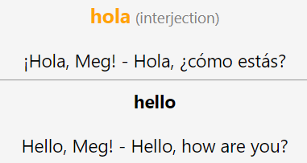

# LexiDeck
### What is it?
**LexiDeck** is an application designed to support language learning in Anki. It does this by taking in a list of words to translate, fetching translations for those words and generating an Anki deck filled with flashcards corresponding to those translations. The application is designed to be flexible and allows words to be entered from a variety of sources, including command line arguments, CSV files and existing Anki decks. The means by which translation data are retrieved is also configurable, with retrieval options including the web scraping of online dictionaries (such as SpanishDict) and API calls to OpenAI (ChatGPT).

### How can I use it?

Let's say we want to create a deck for Spanish -> English flashcards. In the first instance, we'll only add a single word *hola*. We can do this by running the program from the command line and simply specifying the word *hola* for the `--words` argument:

`python ./src/main.py --words hola --retriever-type spanishdict`

The output will be an Anki package file `output.apkg`. Now we need to load that into our existing Anki collection. We can do that by opening up Anki, clicking "Import File", selecting and opening `output.apkg`, and clicking "Import". A new deck "Language learning flashcards" will have been created, containing a single note:

