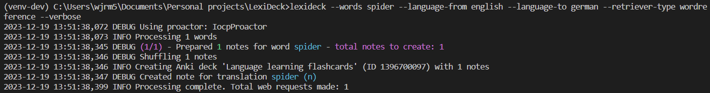
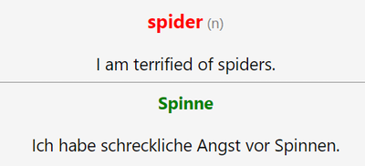
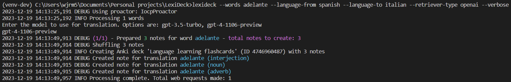
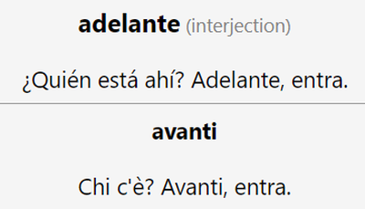
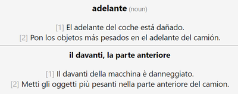
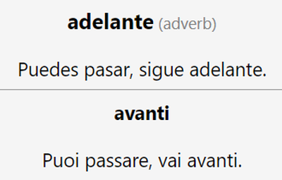

# LexiDeck
## What is it?
**LexiDeck** is an application designed to support language learning in Anki. It does this by fetching translations for a user-specified list of words and generating an Anki deck filled with flashcards corresponding to those translations. The application is designed to be flexible and allows words to be entered via a variety of sources, including command line arguments, CSV files and existing Anki decks. The means by which translation data are retrieved is also configurable, with retrieval options including the web scraping of online dictionaries (such as SpanishDict) and API calls to OpenAI (ChatGPT).

## Basic usage and concepts

Firstly, run `git clone https://github.com/wjrm500/LexiDeck.git` to clone the repository onto your local machine. Then from within the repository, run either `pip install .` for a standard installation of the program, or `pip install -e .[dev]` for a dev installation. You can confirm the installation worked by running `lexideck --version` in your terminal - the output should be `lexideck v1.0.0`.

Now, let's say we want to create a deck of Spanish -> English flashcards. In the first instance, we'll only add a single word *hola*. We can do this by running the program like so:

`lexideck --words hola --language-from spanish --language-to english --retriever-type spanishdict`

The output will be an Anki package file `output.apkg`. Now we need to load that into our existing Anki collection. We can do that by opening up Anki, clicking "Import File", selecting and opening `output.apkg`, and clicking "Import". A new deck "Language learning flashcards" will have been created, containing a single note:

**Front**:

**Front and back**:

As you can see, the note includes a few different components:

**Front**:
- The **word to translate** - *hola* - this is the word we inputted, the word whose translation we want to practice recalling. Depending on the retriever type configured, the word also acts as a hyperlink to a web page containing further information
- The **part of speech** - *interjection* - words can have different meanings depending on the part of speech they are used in. Parts of speech include interjection, noun, verb and adjective. Separate notes are created for each part of speech, for each word being translated

**Back**:
- The **source language example sentence** - *¡Hola, Meg! - Hola, ¿cómo estás?* - this provides useful context and disambiguation, and can also act as a memory aid if you are unable to recall the translation from the word alone
- The **translation** - *hello* - this is the translation of the word to translate in the target language. As with the word to translate, the text can function as a hyperlink to a web page with further information
- The **target language example sentence** - *Hello, Meg! - Hello, how are you?* - this is the translation of the source language example sentence in the target language

To reiterate something I mentioned above - **separate notes are created for each part of speech**, for each word being translated. For example, the Spanish word *amanecer* can be translated as a masculine noun ("dawn"), an impersonal verb ("to dawn") and an intransitive verb ("to wake up" or "to stay up all night"):

This means that if you ran the program like this:

`lexideck --words amanecer --language-from spanish --language-to english --retriever-type spanishdict`

You'd end up with a deck containing not one note but three:

You'll notice that on the final note, we have multiple source language example sentences, definitions and target language example sentences. This happens when there are multiple, distinct meanings for a single word and part of speech. Another example would be the Spanish word *banco*, which as a masculine noun can mean both *bench* and *bank* in English. As a counter-example, in the case of the Spanish noun *papa*, which can mean both *daddy* and *potato*, we end up with two separate notes because *daddy* is the masculine noun translation (*el papa*) while *potato* is the feminine noun translation (*la papa*).

## Sources

In version 1.0.0 of LexiDeck, there are three different ways you can input words:

- **Command line** - this is a simple and convenient way to add a small number of words, but should be reserved for testing and demonstration
- **CSV** - the go-to way to add words in bulk - all you need is a CSV file with a word on each row
- **Existing Anki deck** - if you know of an existing Anki deck that already has all the words you need in it, we can pass its contents into LexiDeck to create a new and improved version of the deck

### Sources - command line
You can enter words via the **command line** just like we did in the examples above - with the argument `--words`:

`lexideck --words mariposa --language-from spanish --language-to english --retriever-type spanishdict`

To enter multiple words, simply separate with a space:

`lexideck --words queso puerta tener --language-from spanish --language-to english --retriever-type spanishdict`

And if you have a "word" that is actually multiple words, such as *a veces*, you can delimit it with speech marks, like so:

`lexideck --words "a veces" --language-from spanish --language-to english --retriever-type spanishdict`

### Sources - CSV

You can enter words from a CSV by specifying the path to the CSV file in the argument `--csv`:

`lexideck --csv words.csv --language-from spanish --language-to english --retriever-type spanishdict`

By default, the source expects (A) that there is no header row containing column names and (B) that the words appear in the first column. If this is not the case for your CSV file, you can configure the source to skip the first row with the `--skip-first-row` argument or take the words from a different column using the `--col-num` argument (column numbers use [zero-indexing](https://en.wikipedia.org/wiki/Zero-based_numbering)).

For your convenience, a CSV contaning a list of 5,000 of the most common English words, extracted from the [Oxford 5000](https://www.oxfordlearnersdictionaries.com/wordlists/oxford3000-5000) list, has been included in this repository: `oxford_5000.csv`.

### Sources - existing Anki deck

You can enter words from an existing Anki deck by specifying the arguments `--input-anki-package-path`, `--input-anki-deck-name` and `--input-anki-field-name`, e.g.,:

`lexideck --input-anki-package-path input.apkg --input-anki-deck-name "Language learning flashcards" --input-anki-field-name Word --language-from spanish --language-to english --retriever-type spanishdict`

Loading words from an existing Anki deck allows you to take advantage of the work done by other Anki language learners in compiling useful words into decks. Here are some instructions that demonstrate how you would utilise the existing deck "[A Frequency Dictionary of Spanish](https://ankiweb.net/shared/info/1350487717)" to create your own Spanish -> English deck:

1. Open the Anki app and click "Get shared". You'll be taken to the web page [`https://ankiweb.net/shared/decks`](https://ankiweb.net/shared/decks)
2. Click "[Spanish](https://ankiweb.net/shared/decks?search=spanish)" under the "Languages" category
3. Click "[A Frequency Dictionary of Spanish](https://ankiweb.net/shared/info/1350487717)"
4. [Download the deck](https://ankiweb.net/svc/shared/download-deck/1350487717?t=eyJvcCI6InNkZCIsImlhdCI6MTcwMjk3Mjk1NiwianYiOjF9.5m6Fi3L_9z-z6W2U9e2hnMlyqRL86Fo-YV8ScU4ZH0U)
5. Import the deck into your Anki collection. You can open the import tool by double-clicking on the downloaded `.apkg` file in your downloads folder, or by opening the Anki app and clicking "Import file". Then click "Import"
6. Open one of the notes in editable mode (you can click "Show" after "Import") and make a note of the name of the field containing the words whose translations you want to practice recalling, in this case `Word`
7. Run LexiDeck! `lexideck --input-anki-package-path /path/to/downloads/_A_Frequency_Dictionary_of_Spanish.apkg --input-anki-deck-name "A Frequency Dictionary of Spanish" --input-anki-field-name Word --language-from spanish --language-to english --retriever-type spanishdict`

## Retrievers

Retrievers are the mechanism through which translations and example sentences are obtained from the internet. You'll have noticed that in all of the above examples, the `--retriever-type` argument is given as `spanishdict`. This was simply done to keep the focus on the other arguments that were relevant to the demonstration; there are multiple types of retriever available:

- `spanishdict` - this retriever scrapes translations and examples from [SpanishDict](https://www.spanishdict.com/). It is accurate and comprehensive, and should be your go-to retriever for generating English -> Spanish or Spanish -> English decks. The website is rate-limited, although LexiDeck handles rate limiting smoothly.

    Available language pairs:
    - English -> Spanish (and *vice versa*)

-  `wordreference` - this retriever scrapes translations and examples from [WordReference.com](https://www.wordreference.com/). It is less reliable than SpanishDict, but offers a wide language selection. This website will sometimes throw a captcha - in these cases, LexiDeck will pause processing and request manual intervention before proceeding.

    Available language pairs:
    - English -> French (and *vice versa*)
    - English -> German (and *vice versa*)
    - English -> Italian (and *vice versa*)
    - English -> Portuguese (and *vice versa*)
    - English -> Spanish (and *vice versa*)
    - French -> Spanish (and *vice versa*)
    - German -> Spanish (and *vice versa*)
    - Italian -> Spanish (and *vice versa*)
    - Portuguese -> Spanish (and *vice versa*)

- `collins` - this retriever scrapes translations and examples from [Collins Online Dictionary](https://www.collinsdictionary.com/dictionary) - or rather, it would if Collins hadn't cleverly protected themselves from scraping using Cloudflare anti-bot protection. To clarify, this retriever **currently works only in theory, not in practice**.

    Available language pairs (in theory):
    - English -> French (and *vice versa*)
    - English -> German (and *vice versa*)
    - English -> Italian (and *vice versa*)
    - English -> Portuguese (and *vice versa*)
    - English -> Spanish (and *vice versa*)

- `openai` - this retriever makes calls to OpenAI's models through the company's API, with models including GPT-3.5 or GPT-4 currently available. As OpenAI APIs are paid, you will need to [create an API key](https://platform.openai.com/docs/quickstart?context=python) and add it to an `.env` file (see `.env.example` for format). It can be a (very) slow and costly alternative to web scraping, but depending on the model the results can be excellent, and the language choice is theoretically unlimited. At this stage this retriever is more experimental than genuinely useful, but future changes to the API might change that. Bear in mind that you will be asked to specify which OpenAI model you wish to use when you use this retriever type. 

    Available language pairs:
    - **Unlimited**

The `--language-from` and `--language-to` arguments are used to help the retriever retrieve the right data. If you enter a language pairing that the specified `--retriever-type` does not support, LexiDeck will inform you and exit immediately.

The `--concise-mode` argument basically reduces the number of notes produced, as well as the amount of text in individual notes, by pruning translations and definitions. It is particularly effective in combination with the `spanishdict` retriever type: SpanishDict makes it clear which are the "principal" translations for a given word, and this information can be used to prune translations or definitions that do not correspond to these principal translations.

Some example commands:

`lexideck --words hello --language-from english --language-to german --retriever-type wordreference --verbose`

`lexideck --words adelante --language-from spanish --language-to italian --retriever-type openai --verbose`

# Additional notes

If you are interested in the inner workings of the application, feel free to check out the source code under the `app` directory. Most classes and methods are documented quite descriptively.

Arguments not explicitly mentioned so far include `--concurrency-limit`, `--output-anki-package-path`, `--output-anki-deck-name`, `--note-limit` and `--verbose`. For more information on these and a comprehensive list of all available arguments, please run:

`lexideck --help`

# Get involved

This project is completely open source and contributions are welcome! Just open a pull request and write a concise description of the change you've made and why, and I'll take a look. Off the top of my head, I would be interested to see:

- New sources that ingest words from databases
- Improvements to the accuracy and robustness of existing retrievers
- New retrievers, preferably web scrapers for online dictionaries, although API-based retrievers could also be interesting
- Better handling of redirect errors in NoteCreator AKA not simply discarding words that fail due to captcha check
- More tests!

I would also be very interested to hear about any larger, architectural changes you have in mind, although in these cases it would be best to contact me to discuss before beginning development.